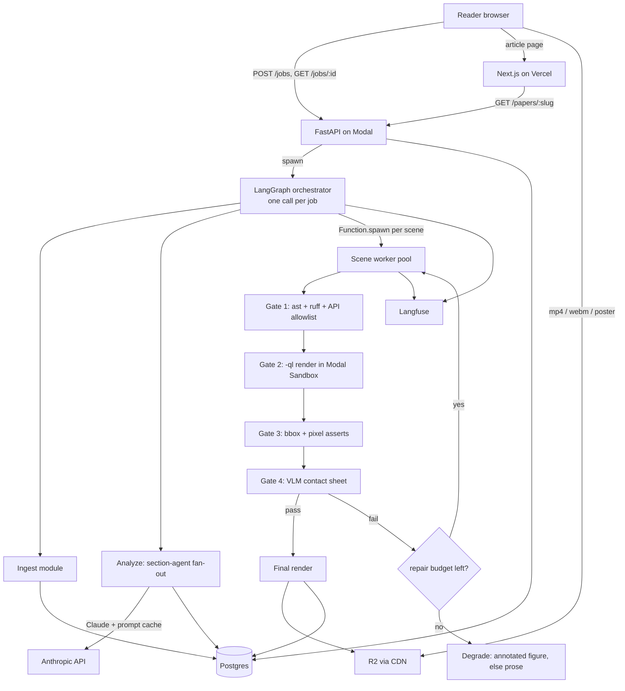

# ArcVisual — System Architecture

**Companion to** [ArcVisual-Master-Plan.md](ArcVisual-Master-Plan.md) · **Version** 0.1 · **Status** pre-build

The plan settled *what* and *which tools*. This settles *how the pieces are wired* — the parts that are expensive to change after Phase 1: the Storyboard contract, who owns the database, how fan-out and repair are accounted for, and what invalidates a cache.

---

## 1. Architecture summary

ArcVisual is a **single Python service deployed entirely on Modal** — control-plane API, LangGraph orchestrator, and render workers are all Modal functions over one Postgres and one R2 bucket. The Next.js reader on Vercel is a **pure consumer**: it calls the Modal HTTP API and streams media from the R2 CDN, and never touches the database. One writer, one language, one deploy surface for all the hard parts.

The pattern is a **modular monolith with an event-driven tail**: the pipeline is one codebase with module boundaries per stage, and the only true concurrency boundary is scene rendering, which fans out via `Function.spawn()`.

---

## 2. Tech stack

| Layer | Choice | Notes |
|---|---|---|
| Control-plane API | FastAPI via Modal `@asgi_app()` | Submit, status, storyboard. No separate API host. |
| Orchestration | LangGraph + `AsyncPostgresSaver` | Checkpointer in Postgres = resumable jobs, no extra infra |
| Compute / queue / sandbox | Modal | `.spawn()` for fan-out, `Sandbox` for Gate 2, Volumes for LaTeX cache |
| Database | Postgres (Neon) | Owned by Python; **Alembic** migrations |
| Schema / validation | Pydantic v2 | The Storyboard *is* the Pydantic model |
| Object storage | Cloudflare R2 + custom CDN domain | Content-addressed keys |
| Reader | Next.js App Router + MDX + Tailwind + KaTeX + Scrollama on Vercel | ISR-cached, read-only |
| Observability | Langfuse (LLM traces) + Sentry (both runtimes) + Postgres metric views | |

**Deliberate omissions in v1:** no Redis, no Celery, no separate worker host, no auth provider, no ORM in the reader. Each is a Stage-2 addition (§9), not a day-one need.

---

## 3. System diagram



**The one rule that keeps this honest:** stages communicate only through the Storyboard row in Postgres. No stage imports another stage's module. A stage is a function `(Storyboard) -> Storyboard` that may only *add* fields it owns.

---

## 4. The Storyboard contract

This is the product's spine. Design constraints, in priority order:

1. **Grounding is structural, not advisory.** Every concept and every scene carries a `SourceSpan`. There is no code path that can produce an ungrounded claim, because the field is non-optional.
2. **Monotonic append.** Each stage gets a narrow write-view; a stage that mutates a field it does not own fails validation in CI, not in production.
3. **`claim` is required and non-empty.** The plan says decorative animation is banned at the schema level — this is that enforcement.
4. **Versioned.** `schema_version` gates cache validity and reader compatibility.

```python
# arcvisual/storyboard.py
SCHEMA_VERSION = "1.0.0"

class SourceSpan(BaseModel):
    """Grounding anchor. quote_sha256 detects source drift on re-ingest."""
    section_id: str
    start: int                        # char offset into section.raw
    end: int
    quote_sha256: str

class Equation(BaseModel):
    id: str
    latex: str                        # verbatim from source, never re-typeset
    label: str | None = None          # \label, for cross-refs
    span: SourceSpan

class Figure(BaseModel):
    id: str
    caption: str
    r2_key: str | None = None         # None => license forbids rehosting
    origin_url: str                   # always present: the link-out
    redistributable: bool             # decided at ingest from the license field

class Section(BaseModel):
    id: str
    heading_path: list[str]           # ["3 Method", "3.2 Attention"]
    raw: str                          # source of truth for offsets
    prose_md: str
    equation_ids: list[str]
    figure_ids: list[str]
    # --- Analyze owns below ---
    difficulty: int | None = None     # 1-5
    concept_ids: list[str] = []

class Concept(BaseModel):
    id: str
    name: str
    statement: str                    # one sentence, paraphrased
    span: SourceSpan
    depends_on: list[str] = []        # concept ids; must form a DAG
    centrality: float                 # 0-1, drives triage rank

class Beat(BaseModel):
    t: float                          # start, seconds
    dur: float = Field(ge=0.8)        # style contract: min 0.8s per beat
    caption: str                      # on-screen text (v1: no audio)

class SceneSpec(BaseModel):
    """What the model produces. Immutable once hashed."""
    id: str
    archetype: Archetype              # enum, one member per template
    claim: str = Field(min_length=10) # the argument this visual makes
    concept_id: str
    span: SourceSpan
    params: dict                      # validated against the template's own model
    beats: list[Beat] = Field(min_length=1)
    scrubbable: bool = False
    priority: int                     # placement order after triage

class GateReport(BaseModel):
    gate1: GateResult
    gate2: GateResult | None = None
    gate3: GateResult | None = None
    gate4: Gate4Result | None = None  # carries the 1-5 clarity score

class Artifact(BaseModel):
    content_hash: str                 # see §7 for the input tuple
    mp4_key: str
    webm_key: str | None
    poster_key: str
    framestrip_key: str
    duration_s: float
    quality: Literal["draft", "final"]

class Scene(BaseModel):
    spec: SceneSpec
    state: SceneState                 # pending|generating|validating|passed|degraded|failed
    attempts: int = 0
    cost_usd: float = 0.0
    artifact: Artifact | None = None
    gate_report: GateReport | None = None
    degraded_reason: str | None = None

class Storyboard(BaseModel):
    schema_version: str = SCHEMA_VERSION
    paper: PaperMeta                  # title, authors, license, arxiv_id, doi
    sections: list[Section]
    equations: list[Equation]
    figures: list[Figure]
    # --- Analyze owns below ---
    concepts: list[Concept] = []
    reading_order: list[str] = []     # section ids, topologically sorted
    # --- Generate/Validate own below ---
    scenes: list[Scene] = []

    @model_validator(mode="after")
    def _dag_and_grounding(self):
        assert_acyclic(self.concepts)
        assert all(s.spec.span.section_id in self.section_ids for s in self.scenes)
        return self
```

**Two architectural constraints this creates on the template library.**

*Instrumentation.* Gate 3 needs every mobject's bounding box at each `play()` boundary, which means no template may render as a bare `manim.Scene` — they render through an instrumented `ArcSceneMixin` mixed in before it. Establish that in Phase 1, before there are 15 templates to retrofit.

*Timing.* `spec.duration_s` comes from the beats, and Gate 2 asserts the rendered duration is within ±20% of it. But the template owns pacing — its holds, easings and `run_time`s are exactly what the model is *not* allowed to see. So the model cannot supply durations that satisfy that assertion, and in practice they miss by 60–90%, which makes Gate 2's duration check fire on every scene and mean nothing. Each template must therefore export `estimate_duration(params)` reporting the runtime it will actually play, and codegen must fit the beats to that number: the model contributes the caption *count* and their text, the template contributes the clock. `estimate_duration` necessarily duplicates the body's timeline (the control plane has no Manim and cannot probe one), so a render-snapshot test has to hold the two together or Gate 2 silently degrades to noise.

---

## 5. Data model

Python owns this schema via Alembic. The reader never reads it directly.

```sql
-- Canonical paper identity. Dedup target for "same URL submitted twice".
CREATE TABLE papers (
  id            UUID PRIMARY KEY DEFAULT gen_random_uuid(),
  arxiv_id      TEXT UNIQUE,
  doi           TEXT UNIQUE,
  slug          TEXT UNIQUE NOT NULL,      -- permalink: /p/attention-is-all-you-need
  title         TEXT NOT NULL,
  license       TEXT NOT NULL,             -- drives redistributable decisions
  source_sha256 TEXT NOT NULL,             -- hash of LaTeX tarball / PDF bytes
  created_at    TIMESTAMPTZ DEFAULT now()
);

-- One pipeline run. (paper, pipeline_version) is the idempotency key.
CREATE TABLE jobs (
  id               UUID PRIMARY KEY DEFAULT gen_random_uuid(),
  paper_id         UUID NOT NULL REFERENCES papers(id) ON DELETE CASCADE,
  pipeline_version TEXT NOT NULL,
  state            TEXT NOT NULL,          -- queued|ingesting|analyzing|rendering|complete|failed
  stage_progress   JSONB NOT NULL DEFAULT '{}',  -- the single row the status poll reads
  storyboard       JSONB,                  -- the contract document
  failure          JSONB,                  -- {code, message, user_facing}
  cost_usd         NUMERIC(10,4) DEFAULT 0,
  submitted_by     TEXT,                   -- salted IP hash in v1; user_id later
  created_at       TIMESTAMPTZ DEFAULT now(),
  completed_at     TIMESTAMPTZ,
  UNIQUE (paper_id, pipeline_version)
);

-- The fan-out unit. One row per scene per job.
CREATE TABLE scenes (
  id            UUID PRIMARY KEY DEFAULT gen_random_uuid(),
  job_id        UUID NOT NULL REFERENCES jobs(id) ON DELETE CASCADE,
  scene_key     TEXT NOT NULL,             -- stable within the job
  archetype     TEXT NOT NULL,             -- the metrics dimension
  state         TEXT NOT NULL,
  attempts      INT DEFAULT 0,
  content_hash  TEXT REFERENCES artifacts(content_hash),
  cost_usd      NUMERIC(10,4) DEFAULT 0,
  UNIQUE (job_id, scene_key)
);

-- Every attempt, kept. This table IS the observability dashboard.
CREATE TABLE scene_attempts (
  id            UUID PRIMARY KEY DEFAULT gen_random_uuid(),
  scene_id      UUID NOT NULL REFERENCES scenes(id) ON DELETE CASCADE,
  attempt_no    INT NOT NULL,
  params        JSONB NOT NULL,
  generated_src TEXT,
  gate_results  JSONB NOT NULL DEFAULT '{}',  -- per-gate pass/fail + payload
  failed_gate   INT,                           -- 1-4, NULL on success
  render_ms     INT,
  cost_usd      NUMERIC(10,4) DEFAULT 0,
  created_at    TIMESTAMPTZ DEFAULT now(),
  UNIQUE (scene_id, attempt_no)
);

-- Content-addressed, GLOBAL. Not scoped to a job — this is what makes reruns cheap.
CREATE TABLE artifacts (
  content_hash   TEXT PRIMARY KEY,
  template_id    TEXT NOT NULL,
  mp4_key        TEXT NOT NULL,
  webm_key       TEXT,
  poster_key     TEXT NOT NULL,
  framestrip_key TEXT NOT NULL,
  duration_s     REAL NOT NULL,
  quality        TEXT NOT NULL,
  bytes          BIGINT NOT NULL,
  ref_count      INT NOT NULL DEFAULT 0,    -- GC eligibility
  created_at     TIMESTAMPTZ DEFAULT now(),
  last_used_at   TIMESTAMPTZ DEFAULT now()
);

CREATE INDEX ON jobs (paper_id, created_at DESC);
CREATE INDEX ON jobs (state) WHERE state NOT IN ('complete','failed');  -- queue depth
CREATE INDEX ON scenes (job_id);
CREATE INDEX ON scene_attempts (scene_id, attempt_no);
CREATE INDEX ON artifacts (last_used_at) WHERE ref_count = 0;
```

**No RLS and no `users` table in v1.** Articles are public and permalinked; there is no per-user data to protect. `submitted_by` holds a salted IP hash purely for rate limiting. When accounts arrive in Phase 4 they add a `users` table and a `saved_articles` join — they do not change anything above. Adding RLS to public content would be ceremony without a threat model.

**Why `scene_attempts` keeps failures forever:** the plan names "first-pass gate rate per archetype" as a core metric and as the economic justification for the template library. That metric is a `GROUP BY archetype` over this table. Discarding failed attempts would discard the only evidence for the plan's central bet.

```sql
-- The dashboard, as a view. Tells you which template to fix next.
CREATE VIEW archetype_health AS
SELECT s.archetype,
       count(*)                                                  AS scenes,
       avg((sa.attempt_no = 1 AND sa.failed_gate IS NULL)::int)   AS first_pass_rate,
       avg(s.attempts)                                            AS mean_attempts,
       mode() WITHIN GROUP (ORDER BY sa.failed_gate)               AS modal_failing_gate,
       avg(sa.render_ms)                                          AS mean_render_ms,
       sum(s.cost_usd)                                            AS total_cost
FROM scenes s JOIN scene_attempts sa ON sa.scene_id = s.id
GROUP BY s.archetype;
```

---

## 6. Service boundaries and API

### Three deployables, one of which is trivial

| Deployable | Contains | Talks to |
|---|---|---|
| `arcvisual-api` (Modal ASGI) | FastAPI, rate limiting, job submission, status, storyboard reads | Postgres |
| `arcvisual-pipeline` (Modal functions) | Orchestrator, ingest, analyze, generate, four gates, render | Postgres, R2, Anthropic |
| `arcvisual-reader` (Vercel) | Next.js article renderer | `arcvisual-api` over HTTP, R2 over CDN |

The reader having **zero database credentials** is the boundary that matters most. It means the reader can be rewritten, open-sourced, or replaced by a static export without touching the pipeline, and a reader compromise leaks nothing.

### Endpoints

```
POST   /api/jobs                     {url}  -> 202 {job_id, slug, cached: bool}
GET    /api/jobs/:id                 -> {state, stage_progress, scene_states[]}
GET    /api/jobs/:id/events          -> SSE, same payload on change (enhancement)
GET    /api/papers/:slug             -> {storyboard}   the reader's single read
GET    /api/papers/:slug/scenes/:key -> {state, artifact}   progressive fill
GET    /api/health                   -> {db, r2, anthropic, queue_depth}
POST   /api/papers/:slug/feedback    {helpful: bool, note?}
POST   /api/papers/:slug/takedown    {reason, contact}   -- the plan promises this path
```

Every route: Pydantic input validation, `submitted_by` rate limiting on `POST /api/jobs` (3/hour/IP, 1 concurrent job), and a structured error envelope `{code, message, user_facing}`.

**Progressive fill — take the boring option first.** The plan says "WebSocket/SSE". On Vercel plus Modal, SSE means holding a connection open through two platforms' timeouts to deliver an event every ~30 seconds. Start with **client polling of `GET /api/jobs/:id` every 3s**, backing off to 10s after two minutes. It is one endpoint reading one JSONB column, it survives every proxy, and it costs nothing to operate. Add the SSE route as a progressive enhancement once the polling version is measurably annoying.

---

## 7. Caching — and the hash input the plan is missing

Four layers, cheapest first:

| Layer | Key | Invalidated by | Saves |
|---|---|---|---|
| L0 Source | `papers.source_sha256` | Author posts a new arXiv version | Re-download and re-parse |
| L1 Prompt | Anthropic prompt cache on the paper body | TTL; body change | ~90% of Analyze tokens across ~20 section agents |
| L2 Artifact | `content_hash` (below) | Any tuple member changing | The whole render — the $4-vs-$40 line |
| L3 Page | Vercel ISR tag `slug@pipeline_version` | Job-completion revalidation | An origin hit per reader |

```python
def content_hash(spec: SceneSpec, env: RenderEnv) -> str:
    return sha256_of(
        spec.archetype,
        canonical_json(spec.params),      # key-sorted, floats rounded to 6dp
        [b.model_dump() for b in spec.beats],
        env.manim_version,                # "0.18.1"
        env.plugin_lock_sha,              # hash of the resolved lockfile
        env.template_source_sha,          # <-- the missing input
        env.arcscene_base_sha,            # <-- and this one
        SCHEMA_VERSION,
    )
```

**The plan's hash tuple is `(template_id, params, manim_version, plugin_versions)`, and that is a correctness bug.** `template_id` is a name, not content. Fix a layout bug inside `transform_chain.py` and every previously-rendered `transform_chain` scene keeps serving the buggy video forever, because its hash never moved. Hash the **template's source bytes** and the **`ArcScene` base class's source bytes**, and a template edit invalidates exactly the affected scenes and nothing else. One line now; a data migration later.

**Canonical params matter too.** `{"n": 2, "color": "#FFF"}` and `{"color":"#FFF","n":2.0}` must hash identically or the cache silently loses much of its value. Sort keys, normalize numeric types, round floats.

**Cold start is the render cost nobody budgets.** The Manim + TinyTeX image is multi-GB; pulling it ten times in parallel for a 40-second render is most of the wall clock. Use Modal memory snapshots and keep `min_containers=1` warm during active hours. Mount the LaTeX font and format cache as a Modal Volume so TinyTeX does not regenerate `.fmt` files per container.

---

## 8. Fan-out and failure semantics

### Orchestration shape

One LangGraph invocation per job, running in **one** long-lived Modal function (`timeout=1800`), checkpointed to Postgres. Inside it, two fan-outs of different kinds:

- **Analyze** — ~20 section agents. Pure I/O against the Anthropic API, so `asyncio.gather` with a semaphore of 8 inside the orchestrator. No spawning; these are network waits, not CPU.
- **Generate/Validate** — N scenes. CPU-bound Manim renders, so `Function.spawn()` per scene into a pool capped by `max_containers=12`, then gather the handles. Each child owns its own repair loop and writes its own `scenes` row.

Putting the repair loop *inside* the child is what keeps the orchestrator simple: it awaits N terminal outcomes, and "degraded" is a normal outcome rather than an exception.

### Repair, budgeted in dollars

```
attempt 1  fail -> feed failing gate output + traceback -> attempt 2 (same template)
attempt 2  fail -> drop to a simpler template for the same concept -> attempt 3
attempt 3  fail -> degrade: paper's own figure + animated annotation overlay
           fail -> prose only, scene.state = failed, slot omitted from the reader
```

Two guards the plan's version lacks:

1. **A per-scene cost ceiling** (`$0.60`), checked *before* each attempt. Attempt count alone does not bound spend — a `custom_scene` burning Opus tokens on a 400-line file costs an order of magnitude more than a parameter tweak. The ceiling is what makes the $4/paper target enforceable rather than aspirational.
2. **A per-job wall-clock deadline** (25 min, from the plan's own p95 criterion). At the deadline, scenes still in flight are cancelled and marked `degraded`, and the article ships with what passed. A late animation is worth less than a page that finished.

Idempotency: every attempt keys on `(scene_id, attempt_no)` with a unique constraint, so a Modal retry after a container death cannot double-charge or double-write.

### Failure taxonomy — fail loud, fail early

| Class | Where | Behavior |
|---|---|---|
| Rejected input (paywalled, scanned, >60pp, non-English, license forbids) | Ingest gate, <5s | 4xx with a specific human reason. Never a silently degraded article. |
| Transient (Anthropic 529, R2 timeout) | Any | Exponential backoff ×3, then fail the stage |
| Scene-local | Generate/Validate | The repair ladder above. Never fails the job. |
| Job-fatal (parse failure, DB unreachable) | Ingest/Analyze | `jobs.failure` with `user_facing` text; the page shows the reason |

**The invariant:** a scene failure degrades a slot; only an ingest or analyze failure can fail a job. A paper with 12 planned animations and 9 that shipped is a success. A paper with one garbled animation is not.

---

## 9. Scaling path

| Stage | Load | Add |
|---|---|---|
| 1 | <50 papers/day | Nothing beyond §2. Single Neon branch, Modal defaults. |
| 2 | ~500/day | Neon autoscaling + PgBouncer; warm `min_containers`; Upstash Redis *only* for rate-limit counters; R2 lifecycle GC on `ref_count=0` artifacts |
| 3 | ~5k/day | Split the render pool by archetype cost class; partition `scene_attempts` monthly; regional R2 |
| 4 | One viral paper | Already handled: L2 + L3 mean the 10,000th reader of one paper costs a CDN hit |

The concurrency ceiling that will actually bind first is **Anthropic tokens/minute during Analyze**, not compute. Instrument it before Phase 2 or you will misdiagnose a rate limit as a slow pipeline.

---

## 10. Phase 1 — the buildable slice

Scope from the plan: arXiv-only, single-pass analysis, three templates, Gates 1–2, manual trigger, exit at 5 papers end-to-end untouched.

```
arcvisual/
  storyboard.py          # §4 in full. Write this first; everything types against it.
  db/models.py           # SQLAlchemy Core over §5
  db/migrations/         # Alembic from commit one
  ingest/arxiv.py        # API metadata -> tarball -> LaTeX -> DocTree
  ingest/latex.py        # \section split, equation extraction, char offsets
  analyze/single_pass.py # ONE Claude call over the whole paper. No graph yet.
  templates/
    base.py              # ArcScene(Scene) + bbox recorder. THE keystone.
    transform_chain.py
    plot_reveal.py
    architecture_flow.py
    registry.py          # archetype -> (template, params model, source_sha)
  generate/codegen.py    # archetype + params -> module source
  gates/g1_static.py     # ast.parse, ruff, API allowlist, params validation
  gates/g2_runtime.py    # -ql in a Modal Sandbox, hard caps, log scrape
  render/modal_app.py    # api / orchestrate / render_scene
  cache/hashing.py       # §7 content_hash, including template_source_sha
reader/                  # Next.js: one route, /p/[slug]
eval/papers.yaml         # 5 papers now, 30 by Phase 2
```

**Build order, and why:**

1. `storyboard.py` plus the Alembic migration. The contract before any producer of it.
2. `templates/base.py`. The `ArcScene` bbox recorder must exist before the first template, or Gate 3 becomes a rewrite of the whole library in Phase 2.
3. `ingest/arxiv.py` end-to-end on one paper, asserting that char offsets round-trip.
4. Three templates with **hand-filled params, no model involved.** Render them locally. This validates the template design independently of codegen quality — and if the animations do not feel good with hand-tuned parameters, no amount of codegen will save them.
5. Gates 1–2, API allowlist first: it is the highest-leverage check in the system and needs no render.
6. Codegen. Now the model only has to fill schemas that are already proven to render.
7. Modal wiring plus the single reader route.

**Do not build in Phase 1:** LangGraph (a single-pass call needs no graph), Gate 4, the repair loop, SSE, R2 lifecycle rules, or the custom-scene hatch. Each has a clean insertion point above, and each would otherwise be built on unvalidated assumptions.

**Exit test, mechanized:**

```bash
python -m eval.run --papers eval/papers.yaml --assert-no-code-changes
# 5/5 complete, 0 human interventions, every scene passes G1+G2,
# per-paper cost logged, per-archetype first_pass_rate recorded as the baseline
```

That baseline number is what Phase 2's ≥60% target is measured against. Without it recorded in Phase 1, the Phase 2 exit criterion is unfalsifiable.

---

## 11. Production checklist (tailored)

**Security**
- [ ] No auth needed in v1 — but rate limit `POST /jobs` by hashed IP (3/hr, 1 concurrent), or the render bill becomes a stranger's decision
- [ ] Modal Sandbox for every generated-code render: no network, 2GB cap, 120s wall clock, tmp-only writes
- [ ] Secrets in Modal Secrets and Vercel env. The Anthropic key never reaches the reader deployable.
- [ ] Pydantic validation on every API input; SQL through parameterized statements only
- [ ] R2 bucket private; public reads only through the CDN domain
- [ ] Generated Manim source is **untrusted input** — the API allowlist is a security control, not only a quality gate

**Reliability**
- [ ] Alembic migrations from commit one; never a hand-edited production schema
- [ ] `/api/health` covering DB, R2, Anthropic, and queue depth
- [ ] Backoff ×3 on all external calls
- [ ] Per-scene cost ceiling and per-job deadline enforced in code, not by convention
- [ ] Neon PITR on; R2 versioning on the artifacts prefix
- [ ] Rollback = pin `pipeline_version`; existing articles keep serving from L2/L3

**Observability**
- [ ] Langfuse trace per job, span per stage, token cost attributed to `job_id`
- [ ] Sentry in both runtimes, release-tagged
- [ ] `archetype_health` on a dashboard — the plan's own core metric
- [ ] Alert on: first-pass rate dropping >10pp week-over-week, p95 >25 min, cost/paper >$5

**Ops**
- [ ] GitHub Actions: ruff, mypy, pytest, and **render-snapshot tests per template** (the pinned-version drift mitigation)
- [ ] dev / staging / prod as separate Modal apps plus Neon branches
- [ ] Eval set frozen, run on every PR before merge

---

## 12. Open decisions this document forces

The plan's §14 list, narrowed by the above:

1. **Compute plane** — Modal. §6 assumes it; the ASGI-app-plus-spawn shape is why the plan's "collapses four services into one" claim actually holds.
2. **Custom scenes in v1** — no. The per-scene cost ceiling (§8) is the mechanism that would make them safe, and it needs real gate metrics to calibrate.
3. **Public gallery vs. private links** — **needs an answer before Phase 1 ships.** `papers.slug` being globally unique and unauthenticated (§5) already assumes public permalinks. Private links would mean a token column, a `noindex` posture, and a different licensing story. Cheap to decide now, expensive after the first hundred articles are indexed.
4. **Animation cap** — leave it at 8–12; `priority` in `SceneSpec` makes the cap a config value, so Phase 0 reader feedback can move it without a schema change.
5. **Taxonomy owner** — unchanged, and still the highest-risk unstaffed role. The taxonomy is the one thing here that no amount of good architecture substitutes for.

**One additional decision this analysis surfaces — final render quality.** The plan specifies `-qh` 1080p60. A 30-second scene at 1080p60 on Modal CPU can take several minutes, and it is the single largest contributor to the 4–8 minute render budget. Ship `-qm` (720p30) as the default final quality and reserve `-qh` for scenes flagged `scrubbable`, where frame-accurate seeking actually depends on it. Revisit with real render timings from the Phase 1 baseline.
